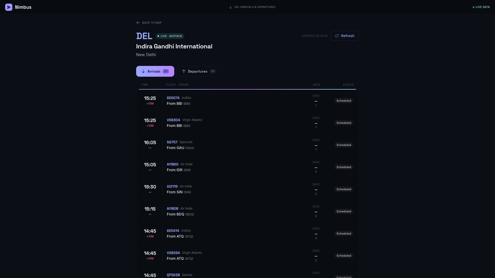

  <h1>🌍 Nimbus Flight Tracker</h1>
  
A globally interactive, real-time 3D flight tracking application built for aviation enthusiasts.

## ✨ Features

- **Live 3D Globe Visualization**: Browse real-time global flights rendered on an interactive 3D WebGL globe.
- **Flight Telemetry Dashboard**: Get detailed information for individual flights, including altitude, velocity, and dynamic heading arcs.
- **Live Airport Boards**: Check arrivals, departures, delays, and terminal data for the world's top 50 busiest airports.
- **Dual Data Sources**: Powered by the **OpenSky Network** for globe data and **Aviation Edge / AviationStack** for scheduled timetables.

### Airport Departures & Arrivals

### Real-Time Flight Details

---
