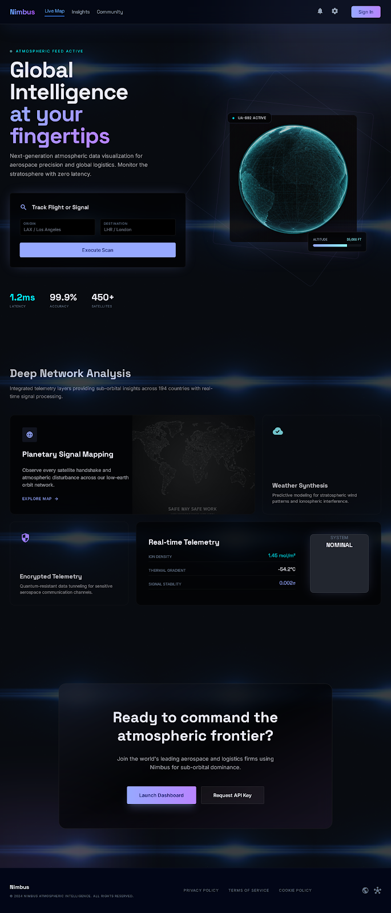
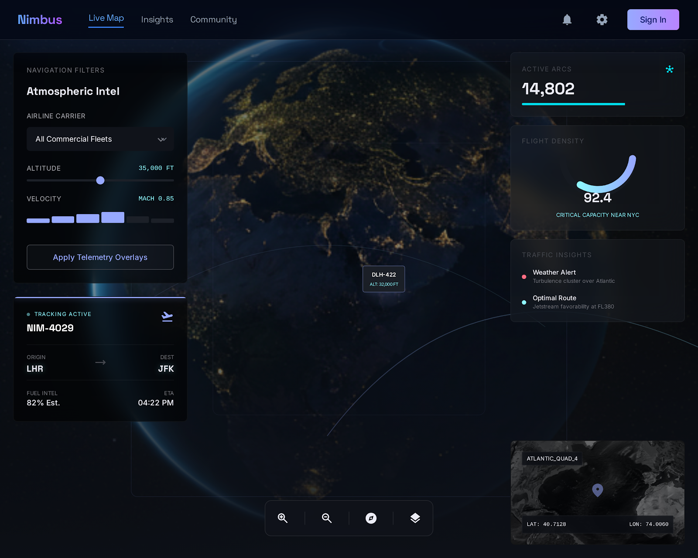
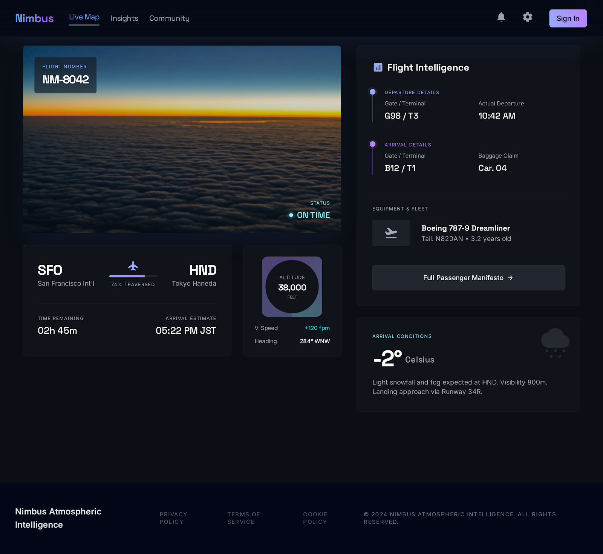

<div align="center">
  <h1>🌍 Nimbus Flight Tracker</h1>
  <p>A globally interactive, real-time 3D flight tracking application built for aviation enthusiasts.</p>
</div>



## ✨ Features

- **Live 3D Globe Visualization**: Browse real-time global flights rendered on an interactive 3D WebGL globe.
- **Flight Telemetry Dashboard**: Get detailed information for individual flights, including altitude, velocity, and dynamic heading arcs.
- **Live Airport Boards**: Check arrivals, departures, delays, and terminal data for the world's top 50 busiest airports.
- **Dual Data Sources**: Powered by the **OpenSky Network** for globe data and **Aviation Edge / AviationStack** for scheduled timetables.

### Live Globe Map


### Real-Time Flight Details


---

## 🚀 Quick Start (Local Development)

### 1. Backend Server Setup (`/api`)
Built with Python 3.10+ and Flask.

```bash
cd api
python3 -m venv venv
source venv/bin/activate
pip install -r requirements.txt
python app.py
```
*(The backend connects to live data sources, and serves data over `http://localhost:5001` locally).*

### 2. Frontend App Setup (`/frontend`)
Built with React, Vite, Tailwind CSS, and Three.js.

```bash
cd frontend
npm install
npm run dev
```

---

## ☁️ Production Deployment Structure

This application is split into two structural components: a Python Flask backend (`/api`) and a React/Vite front-end (`/frontend`).

### 1. Deploying the Backend (Render, Railway, Heroku)
1. Fork or clone the repository to your GitHub account.
2. Create a new Web Service on Render (or equivalent platform).
3. Connect your repository and select the `api/` directory as your **Root Directory**.
4. Set the Build Command: `pip install -r requirements.txt`
5. Set the Start Command: `gunicorn -w 4 -b 0.0.0.0:$PORT app:app` (This is also handled naturally by the `Procfile` already included).
6. Set your Environment Variables as shown in `api/.env.example` to fetch live aviation data.

### 2. Deploying the Frontend (Vercel, Netlify)
1. Proceed to Vercel and create a new project from your freshly updated repo.
2. Select the `frontend/` directory as the **Root Directory**.
3. The Build command will automatically be detected as `npm run build` or `vite build`.
4. Add the Environment Variable `VITE_API_URL` and set it to the URL of your successfully deployed backend (e.g., `https://nimbus-api.onrender.com`).
5. Deploy! Client-side routing is automatically handled by the included `vercel.json` file.
